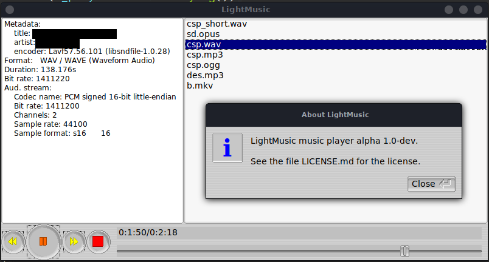

# LightMusic


A lightweight music player. It is written in C++, uses
`libav` (ffmpeg fork) for handling audio and `FLTK` for GUI.



# Building

## Installing dependencies

Dependencies:
* libavformat
* libavcodec
* libavdevice
* libavutil
* libswresample
* libfltk1.3
* libfltk-images1.3

To install them on Debian Linux:
```sh
sudo apt install libavformat-dev libavcodec-dev libavdevice-dev libavutil-dev libswresample-dev libfltk1.3-dev libfltk-images1.3
```

## Compiling

Open the terminal in the folder where the source code is.

Execute these commands:
```sh
mkdir build # Create a directory to build in
cd build # Step into it
cmake .. # Generate build files
make -jx # Compile (replace x with the number of threads to use)
```
After building, the binary can be found in the same directory.

## Creating desktop file
A desktop file can be created to put on your desktop or in your menu.

To generate it, execute `gen_desktop_icon.py` with python3.
Usually this can be done like this:
```sh
python3 ./gen_desktop_icon.py
```
The output filename is `LightMusic.desktop`.
